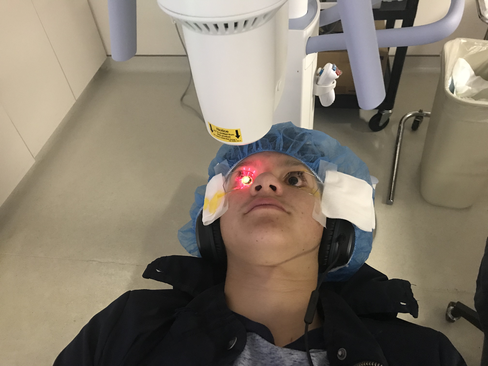

I found out officially I had keratoconus at the age of 14, this blog post is  about how I found out about my keratoconus and the struggles my family and I had to go through to solve it.

**This blog post will be split into two parts, part one finding out about keratoconus, and part two the cross-linking.**

## Finding out about keratoconus

I was 14 around the time where I started to see large changes in my eyesight, I of course did not know how or why they were happening. I started having trouble in school because I would not be able to concentrate in class, my grades began to drop as a result. Of course I suffered in sports aswell, I began to have a hard time with depth perception severly impeding my abilities. Fortunetly for me my mother knew of her own keratoconus and we considered a possibility of me having it aswell. This is where things get messy, finding an optometrist to diagnose my keratoconus was by far the hardest part of the process. Most optometrists, since it is not a required process and an expensive machine, do not have the equipment to diagnose keratoconus. The closest location to me was over an hour away! 

When I was diagnosed for keratoconus I found out about more than a couple things that could've led up to point in which my cornea gained a slight cone shape. Terrible allergies (which I had), Dry eyes (which I had), Constant eye irritation (I rubbed my eyes far too much), and of course the infamous genetics. Luckily for me, although I have found my vision loss quite distressing, we had found my keratoconus relatively early and were able to complete the less invasive fix, cross-linking.

## The Cross-Linking

My family and I were able to find an ophthomologist who was able to do the cross linking for me in miami within a month of the diagnosis. We were able to complete the hour long procedure during the summer holidays, and although it was grueling it was no where near as bad as I thought it would be. Although laying down with UV light shined into my eyes it was worth it for the slow down of the keratoconus development which at that time was developing very fast. With this treatment I was able to switch to sclarel lenses that would both help keep my cornea in a proper shape and increase my eyesight tenfold, and of course now I have been able to perform better in school and in sports (I would say not falling asleep in class is pretty helpful). 

